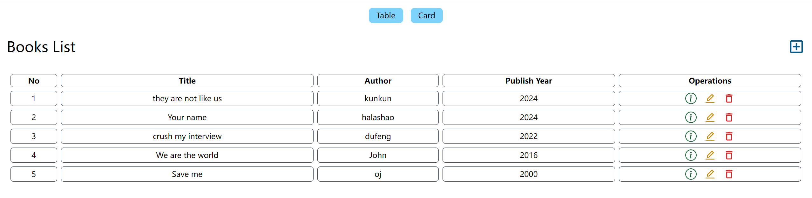
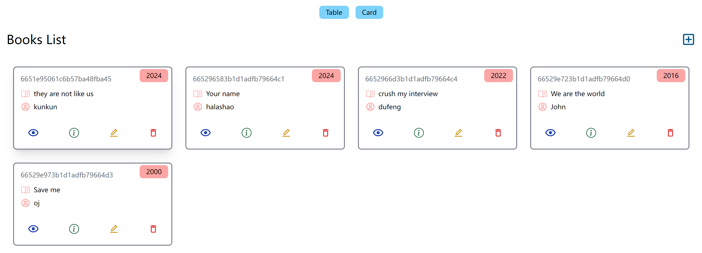

## Bookstore MERN
<hr>


  
<br>
<br>
This project contains basic CURD operations suitable for developers who never used MERN stack.

### Prerequisite
Before doing this project you need to understand
- React basics like components and hooks(useState, useEffect etc.)
- HTTP proctocal
  
### Preview



### Installtion
Clone project
```git bash
git clone https://github.com/xueyulinn/bookstore_MERN_stack
```
Install necessary dependancies for both frontend and backend
```node
npm install
```
Run backend and frontend
```node
npm run dev
```


